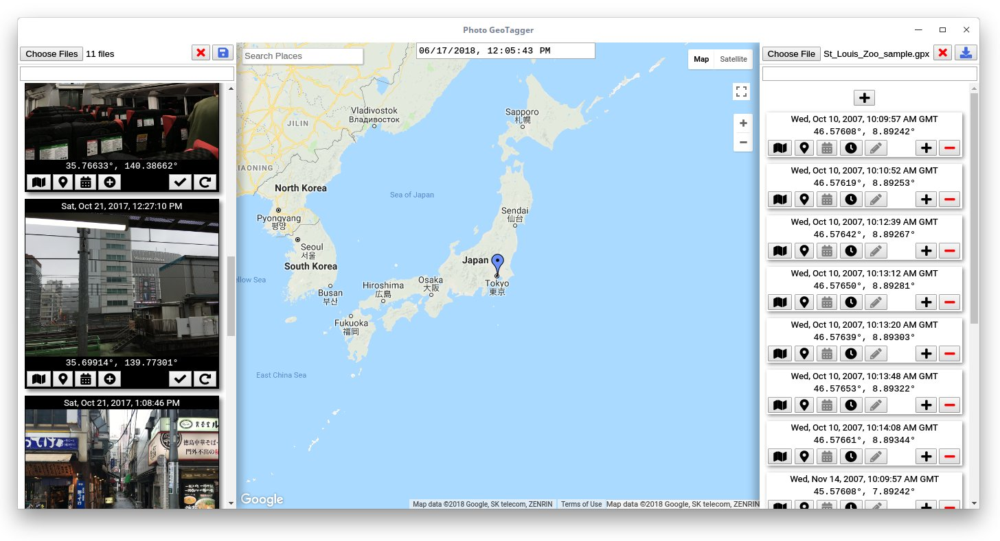
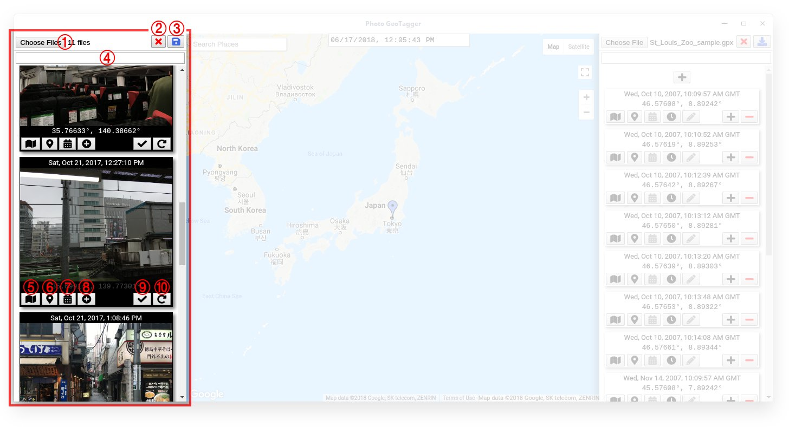
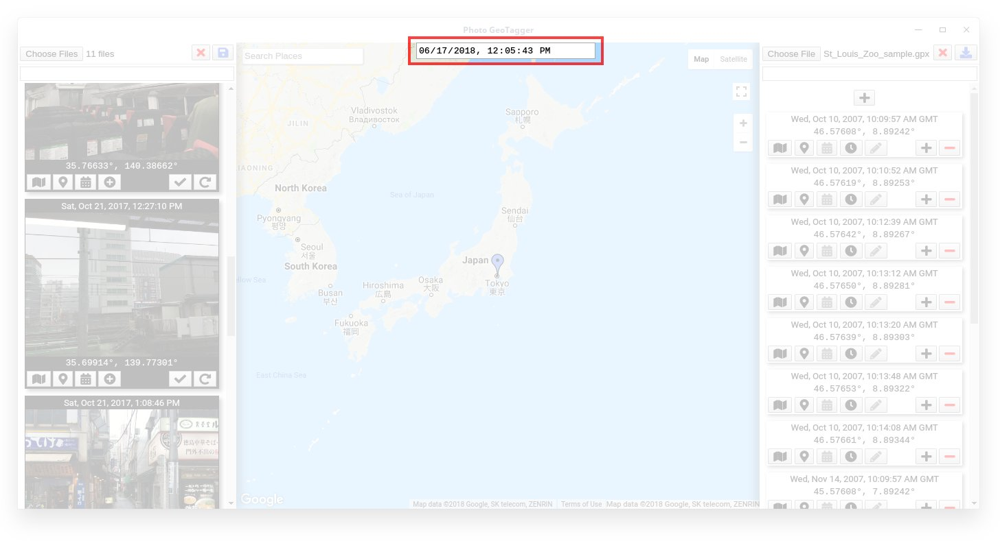
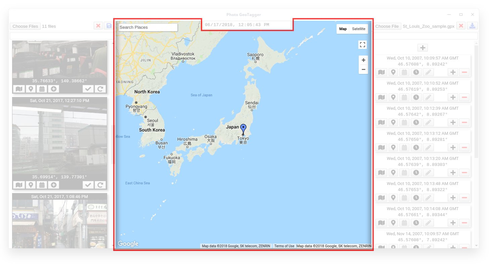
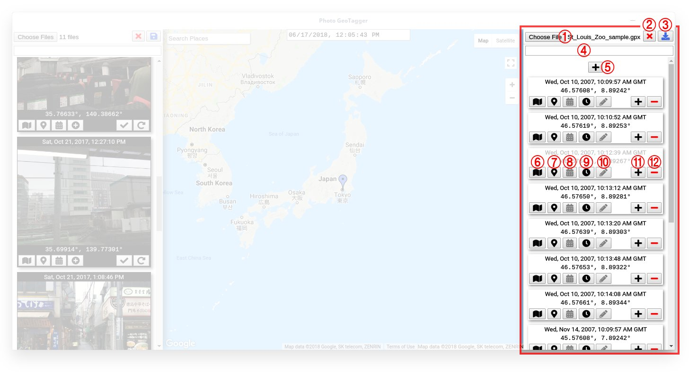

# Photo GeoTag

Photo GeoTag is an application that helps user to edit the Date/Time and GPS properties of multiple images. Photo GeoTag was developed because of the lack of convenient applications to set the GPS locations for multiple photos using a map or based on a GPX tracking file. Furthermore it was intended to provide support for KML export to merge GPS tracked paths with photos taken during the trip.

## User Interface

The application requires an internet connection to consume geographic and timezone information from the corresponding online services. The UI of the application consists of four parts. The parts are internally connected to exchange various information with each other (e.g. *GPS-Location*).

**WARNING:** This application is still in early development, always make backups of your photos before you edit them!

### Photo Panel

Located on the left side, the photo panel provides various functionalities to modify image files.
The images that are currently loaded for editing will be shown in a list with thumbnails.

1. Load image files from the hard disk (do not load excessive amounts that cannot be handled by your system)
2. Press this button to clear the list of images (this will unload your images from the application, <u>not</u> deleting them from your hard disk)
3. Press this button to save all modifications for each image
4. Filter the images currently shown in the list by their *Date/Time* or *GPS-Location* properties
5. Press this button to show the *GPS-Location* of this photo in the [Map Panel](#map-panel) (this will move the marker in the map)
6. Press this button to replace the *GPS-Location* property of this image with the current *GPS-Location* of the marker in the [Map Panel](#map-panel)
7. Press this button to replace the *Date/Time* property of this image with the *Date/Time* that is currently set in the [Date/Time Panel](#datetime-panel)
8. Press this button to add this photo based on its current *Date/Time* and *GPS-Location* property as new tracking point to the list of tracking points in the [Track Panel](#track-panel)
9. Press this button to save the modifications for this image
10. Press this button to reload all EXIF properties for this image from the file (unsaved modifications for this image will be lost)

### Date/Time Panel

This is a very basic *Date/Time* picker at the top of the application, that allows other panels to apply the currently selected value (e.g. to images or to tracking points).

### Map Panel

The map panel is located in the center and uses the google map service. On top of the default behavior, the user can set a position marker by clicking anywhere on the map. This position marker can then be used by other panels to apply the current position (e.g. to images or to tracking points). Eventually a red path is drawn on the map, reflecting the current  tracking points from the [Track Panel](#track-panel).

### Track Panel

The track panel is located on the right side and provides various functionalities related to tracking points. This is very helpful when assigning *GPS-Location*s to images without *GPS-Locations*, but that were tracked using an external GPS tracking device. The *Date/Time* property can then be used to identify the corresponding *GPS-Location* for an image from the tracking points. Furthermore it is possible to create a new list of tracking points based on existing geo-tagged images to reconstruct the traveled trail.

1. Import tracking points from a GPX file from the hard disk (only load small files with less points that can be handled by your system)
2. Press this button to clear the list of tracking points (this will unload your images from the application, <u>not</u> deleting them from your hard disk)
3. Press this button to export the current list of traking points
4. Filter the tracking points currently shown in the list by their *Date/Time* or *GPS-Location* properties
5. Press this button to insert a new tracking point at the beginning of the list using the current *GPS-Location* of the marker in the [Map Panel](#map-panel) and the *Date/Time* that is currently set in the [Date/Time Panel](#datetime-panel) (the time is interpreted as local time for the timezone of the *GPS-Location* for this tracking point)
6. Press this button to show the *GPS-Location* of this tracking point in the [Map Panel](#map-panel) (this will move the marker in the map)
7. Press this button to replace the *GPS-Location* property of this tracking point with the current *GPS-Location* of the marker in the [Map Panel](#map-panel)
8. Press this button to replace the *Date/Time* property of this tracking point with the *Date/Time* that is currently set in the [Date/Time Panel](#datetime-panel) (the time is interpreted as local time for the timezone of the *GPS-Location* for this tracking point)
9. ... => may become obsolete (automatically when doing 7 or 8)
10. ...
11. Press this button to insert a new tracking point after this tracking point using the current *GPS-Location* of the marker in the [Map Panel](#map-panel) and the *Date/Time* that is currently set in the [Date/Time Panel](#datetime-panel) (the time is interpreted as local time for the timezone of the *GPS-Location* for this tracking point)
12. Press this button to remove this tracking point from the list of tracking points

## How To …

### … Open Image Files

Click the file chooser button ① in the [Photo Panel](#photo-panel) and navigate to the directory containing the images that shall be loaded. Select the images and confirm the dialog.

### … Set the Marker on the Map from an Image's Location?

Just click the button ⑤ for the image whose *GPS-Location* shall be applied to the marker in the [Map Panel](#map-panel). The map will automatically scroll to the marker if it is out of the viewport.

### … Change the Location of an Image?

Set the marker for the *GPS-Location* you want to assign to the image by clicking the corresponding location in the [Map Panel](#map-panel).  Click the button ⑦ of the image in the [Photo Panel](#photo-panel), where the new *GPS-Location* shall be applied. Optionally click the button ⑨ to save the changes to the image immediately.

### … Change the Date/Time of an Image?

Set the *Date/Time* you want to assign to the image in the [Date/Time Panel](#datetime-panel) and then click the button ⑦ of the image in the [Photo Panel](#photo-panel), where the new *Date/Time* shall be applied. Optionally click the button ⑨ to save the changes to the image immediately.

## Development

### Environment

Photo GeoTag is build with the electron application framework.

- Install NodeJS and NPM
- Install NPM package *electron* (globally)
  `npm install -g electron`
- Install NPM package *polymer-cli* (globally)
  `npm install -g polymer-cli`
- Install NPM package *asar* (globally)
  `npm install -g asar`
- Clone the project repository from github
  `git clone 'https://github.com/ronny1982/pheotag.git pheotag'`
- Open a terminal and navigate to the `src` subdirectory of the project
- Install all required NPM modules
  `npm install`

### Run

- Open a terminal and navigate to the `src` subdirectory of the project
- Run the application with electron
  `electron .`

### Build

1. Make sure the required packaging tools are installed (dpkg, rpm)
2. Open a terminal and navigate to the root directory of the project
3. Create 32/64 bit and deb/rpm packages by running the following script:
   `sudo ./build-linux.sh`
4. The packages will be created in the `build` sub-directory of the project

#### MacOSX

...

#### Linux

...

#### Windows

...